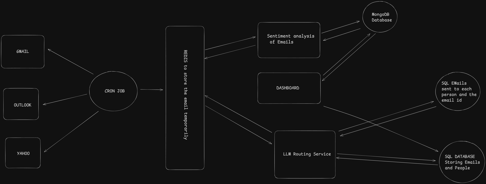

# Email Router Dashboard 📧

The **Email Router Dashboard** is a backend system designed to process, analyze, and route emails efficiently. It integrates with Redis and SQLite for data storage and provides a user-friendly Streamlit interface for monitoring and managing email-related operations.

---

## Features

- **Email Processing**: Automatically fetch, analyze, and forward emails based on predefined rules.
- **Sentiment Analysis**: Classify emails as positive, negative, or neutral using advanced NLP models.
- **Redis Integration**: Store and manage email routing data efficiently.
- **SQLite Database**: Track email metadata and maintain logs.
- **Streamlit Dashboard**: Monitor and control the system in real-time.

---

## System Design

Below is the system design of the project:

---

## Setup Instructions

1. **Clone the Repository**
2. **Create a Virtual Environment**
3. **Install Dependencies**
4. **Run the Streamlit App**

---

## How to Use

Navigate to the Streamlit Dashboard:

Open the app in your browser at [http://localhost:8501](http://localhost:8501)

### Features:

- **Feedback**: Submit feedback and analyze email responses.
- **People Metadata**: Add and manage metadata for email routing.
- **Sentiment Analysis**: Perform sentiment analysis on emails stored in Redis.

---

## Technologies Used

- **Python**: Core programming language.
- **Streamlit**: For building the interactive dashboard.
- **Redis**: For caching and managing email data.
- **SQLite**: For storing metadata and logs.
- **Hugging Face Transformers**: For sentiment analysis.

---

## Contributing

Contributions are welcome! Please fork the repository and submit a pull request.

---

## License

This project is licensed under the **MIT License**.

---

## Contact

**Name**: Yash Bhoomkar  
**Email**: yash31204testing@gmail.com
